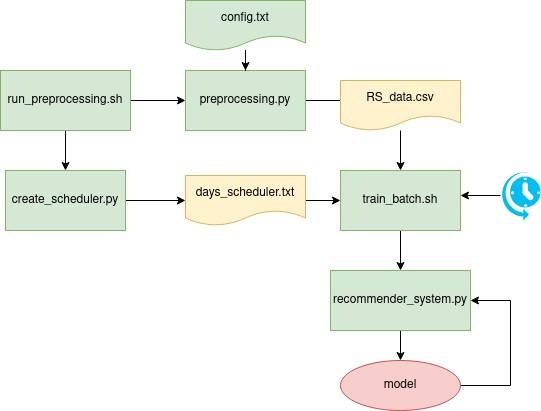

# Cloud Computing project

## Who are we?

| Name | Matricola |
| --- | --- |
| Martina Betti | 1799160 |
| Federico Fontana | 1744946 |
| Romeo Lanzino | 1753403 |
| Stefania Sferragatta | 1948081 |

## How-tos

### S3 bucket

#### Preprocessing
This script extracts the month names of the file to be preprocessed according to the 'config.txt' file. Each of the preprocessed files are renamed with a 'proc_' prefix. All processed files are then merged into a single file 'RS_data.csv'. Lastly, based on the first and the last timestamp, the file 'days_scheduler.txt' is created. To run the preprocessing and create the scheduler:

```bash 
bash s3_bucket/preprocessing.sh 
```

#### Model training
This script will iterate though each day (raw in scheduler.txt) and extract the rows corresponding to that day to train the model. At the end of the training the script will sleep for 10 minutes and then train the data corresponding to the next day.

```bash 
bash s3_bucket/train_scheduler.sh 
```


#### Cosa caricare in S3 nella working directory:
- run_preprocessing.sh
- train_scheduler.sh
- Oct.csv, Nov.csv, Dec.csv (piccoli da sostiuire con file interi)
- config.txt
- create_scheduler.py
- preprocessing.py
- train.py




### How to setup the environment

The project is built upon Python 3.8 using the PySpark package.

We recommend installing [Anaconda](https://www.anaconda.com/products/individual), which comes bundled with many useful
modules and tools such as the virtual environments.

After Anaconda is installed, you can install Python's dependencies with:

```bash
pip install -r requirements.txt
```

At this point you should have the correct environment to interact with the scripts in this project.

### How to train the model

Be sure to have the dependencies installed and just type:

```bash
python train.py
```

### How to build and run the Docker container

To **build** the container, from the root folder (the one with `Dockerfile`, `requirements.txt` etc) type:

```bash
bash scripts/docker_build.sh
```

To **run** the container, from the root folder type:

```bash
bash scripts/docker_run.sh
```


